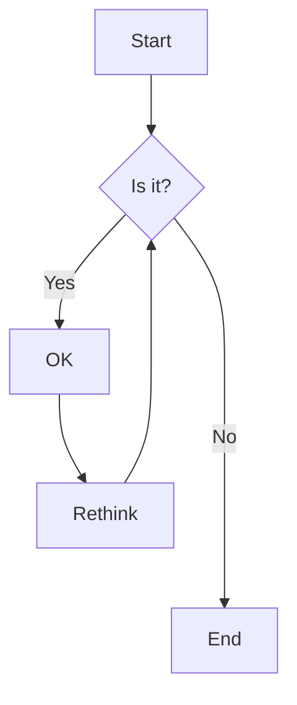
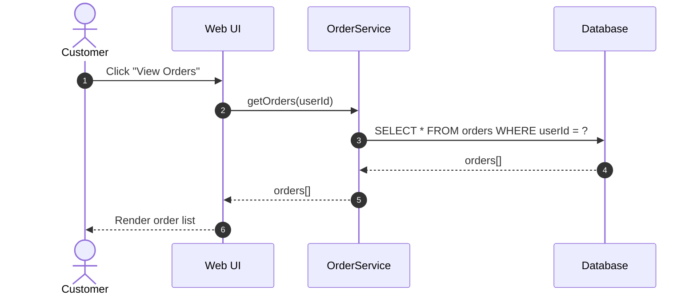
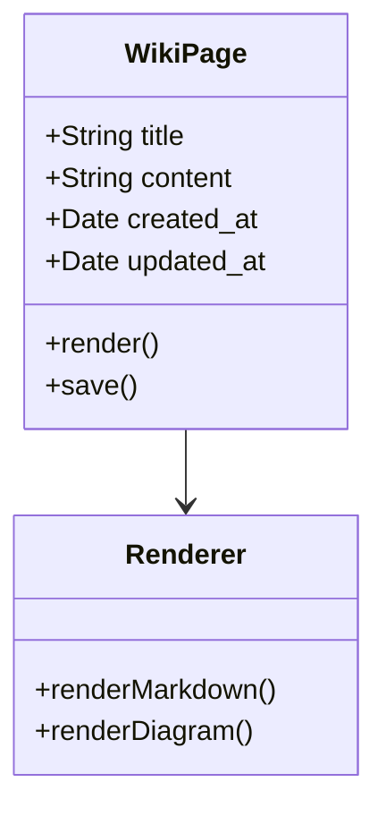
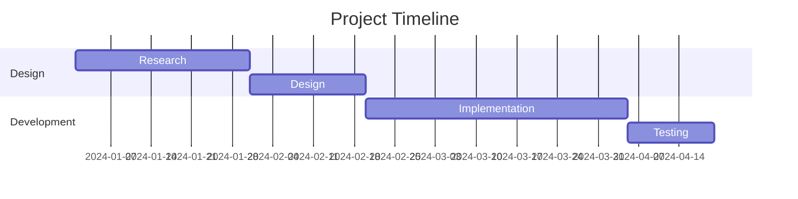
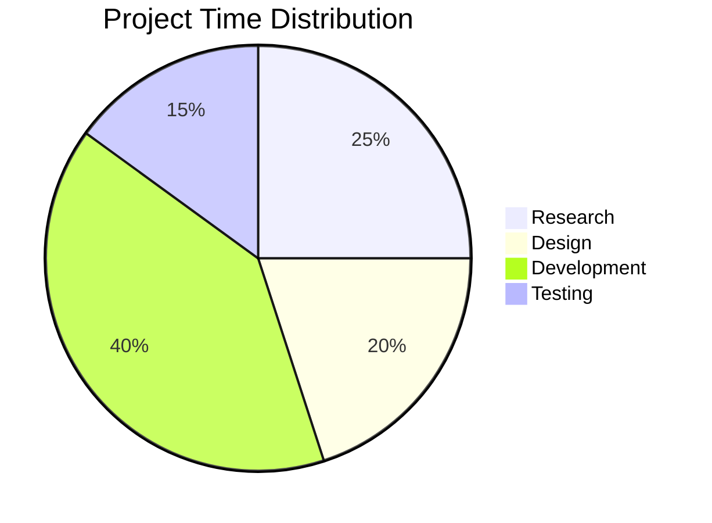
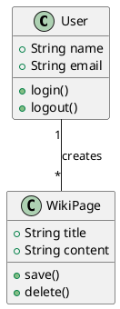
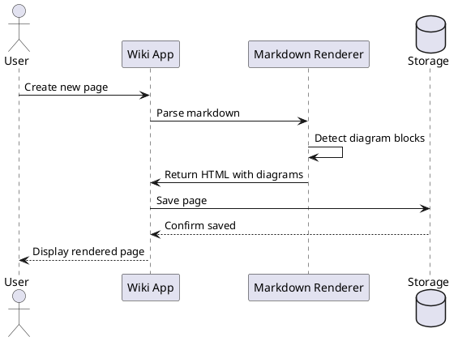
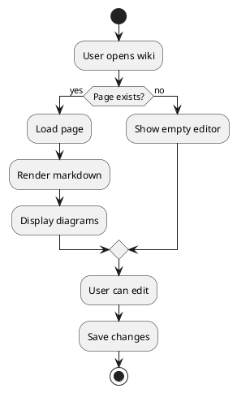
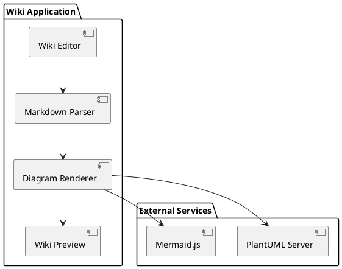
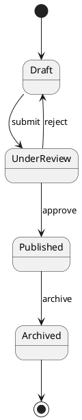

# Diagram Examples for Wiki

This document demonstrates the PlantUML and Mermaid diagram support in the wiki.

## Mermaid Diagrams

### 1. Flowchart Example

### 2. Sequence Diagram

### 3. Class Diagram

### 4. Gantt Chart

### 5. Pie Chart

## PlantUML Diagrams

### 1. Simple Class Diagram

### 2. Sequence Diagram

### 3. Activity Diagram

### 4. Component Diagram

### 5. State Diagram

## Testing Instructions

To test these diagrams:

1. Create a new wiki page in the application
2. Copy any of the diagram examples above
3. Paste into the wiki editor
4. The preview pane should automatically render the diagrams
5. Verify that both PlantUML and Mermaid diagrams render correctly

## Supported Diagram Types

### Mermaid (Client-side rendering)
- Flowcharts
- Sequence diagrams
- Class diagrams
- State diagrams
- Entity Relationship diagrams
- Gantt charts
- Pie charts
- Git graphs
- And more...

### PlantUML (Server-side rendering via plantuml.com)
- Class diagrams
- Sequence diagrams
- Use case diagrams
- Activity diagrams
- Component diagrams
- State diagrams
- Object diagrams
- Deployment diagrams
- Timing diagrams
- And more...

## Notes

- PlantUML diagrams are rendered using the public PlantUML server at www.plantuml.com
- Mermaid diagrams are rendered client-side using Mermaid.js
- Both diagram types support dark/light mode themes
- Diagrams are responsive and will scale to fit the preview pane
