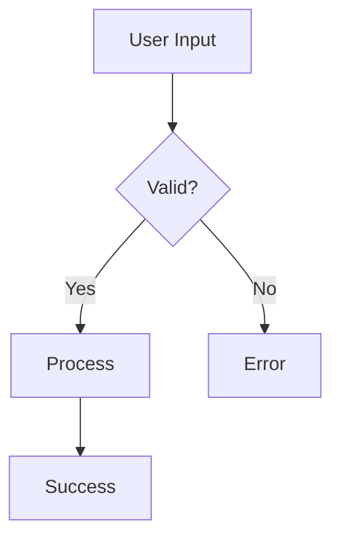
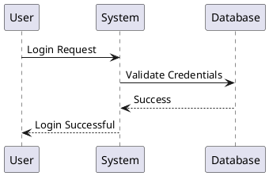

# PlantUML and Mermaid Support Implementation Notes

## Summary
This implementation adds dynamic diagram rendering support for PlantUML and Mermaid in the wiki's markdown editor.

## Problem Statement (Chinese)
我们可以在wiki的markdown 里面嵌入plantuml 和mermiad，wiki 能够对这些图进行动态渲染

Translation: "We can embed PlantUML and Mermaid in wiki markdown, and the wiki can dynamically render these diagrams"

## Solution

### 1. Dependencies Added
- `mermaid@11.12.1` - Client-side diagram rendering
- `plantuml-encoder@1.4.0` - Encodes PlantUML diagrams for server-side rendering

### 2. Core Changes

#### src/utils/markdown.ts
**Key Features:**
- Custom code block renderer that detects `plantuml` and `mermaid` language tags
- PlantUML diagrams are encoded and rendered via www.plantuml.com SVG API
- Mermaid diagrams are prepared for client-side rendering with proper HTML escaping
- Unique IDs generated using `crypto.randomUUID()` with fallback for older browsers
- Efficient HTML escaping using regex-based string replacement
- Meaningful alt text extraction from diagram content

**Code Flow:**
1. `marked` library parses markdown
2. Custom renderer intercepts code blocks
3. If language is 'plantuml': encode → generate URL → create img tag
4. If language is 'mermaid': escape HTML → wrap in pre.mermaid
5. Other code blocks: syntax highlight with highlight.js

#### src/components/WikiPreview.vue
**Key Features:**
- Initializes Mermaid.js with strict security settings
- Watches for content changes and triggers Mermaid rendering
- Uses component ref to scope DOM queries (prevents affecting other components)
- Implements race condition prevention for rapid content updates
- Proper state management: unprocessed → processing → rendered

**Rendering Flow:**
1. Content changes detected by watcher
2. Check if rendering already in progress (prevent race condition)
3. Wait for DOM update with `nextTick()`
4. Query for unprocessed `.mermaid` elements within component
5. Mark elements as 'processing'
6. Call `mermaid.run()` to render
7. Mark elements as 'rendered'
8. Reset rendering flag

### 3. Security Measures

**HTML Sanitization:**
- Maintains existing sanitizeHtml function
- Blocks dangerous tags: script, style, iframe, object, embed, link
- Removes on* event handlers
- Removes javascript: URLs
- Allows SVG elements needed for diagrams

**Mermaid Security:**
- Strict security level enabled
- No inline event handlers
- Sanitized text input

**PlantUML Privacy:**
- Noted that content is sent to public server
- Recommended self-hosting for sensitive content

### 4. Styling
Added CSS for diagram containers:
- Light/dark mode support
- Responsive sizing
- Bordered containers with rounded corners
- Proper spacing and padding
- Error state styling

### 5. Documentation

**DIAGRAM_EXAMPLES.md:**
- 30+ example diagrams
- Covers major diagram types for both PlantUML and Mermaid
- Ready-to-use templates

**WIKI_FEATURE.md:**
- Complete feature documentation
- Usage examples
- Troubleshooting guide
- Best practices
- Privacy considerations

## Testing

### Build Verification
- ✅ `npm run build` succeeds
- ✅ No TypeScript errors
- ✅ No ESLint errors

### Security Verification
- ✅ CodeQL scan: 0 vulnerabilities
- ✅ Dependency check: 0 vulnerabilities
- ✅ HTML sanitization functional

### Manual Testing Recommendations
1. Create a wiki page
2. Add Mermaid flowchart from examples
3. Verify it renders in preview pane
4. Add PlantUML class diagram from examples
5. Verify it renders in preview pane
6. Test rapid typing/editing (race condition prevention)
7. Test dark/light mode switching
8. Verify diagrams are responsive

## Usage Examples

### Mermaid Flowchart
```markdown

````

### PlantUML Sequence Diagram
```markdown

````

## Browser Compatibility

### Supported
- Chrome/Edge 89+
- Firefox 88+
- Safari 14+
- Modern browsers with ES6+ support

### Fallbacks
- `crypto.randomUUID()` falls back to timestamp + random string
- DOM escaping uses standard string replacement

## Performance Considerations

### Optimizations Applied
- String-based HTML escaping (no DOM creation)
- Race condition prevention (single render at a time)
- Scoped DOM queries (component-level only)
- Mermaid renders on-demand (not on page load)

### Known Limitations
- PlantUML requires internet connection
- Complex diagrams may take longer to render
- Very large Mermaid diagrams may impact performance

## Future Enhancements

### Potential Improvements
1. Self-hosted PlantUML server option
2. Diagram caching to reduce re-renders
3. Diagram export functionality (PNG, SVG)
4. Visual diagram editor
5. Additional diagram libraries (GraphViz, D3.js)
6. Custom theme support
7. Diagram size optimization
8. Offline PlantUML rendering

## Maintenance Notes

### When Updating Dependencies
- Test both PlantUML and Mermaid rendering
- Verify security settings still apply
- Check for breaking changes in Mermaid API
- Verify plantuml-encoder compatibility

### Common Issues
1. **Diagrams not rendering**: Check browser console for errors
2. **PlantUML fails**: Verify internet connection to plantuml.com
3. **Race conditions**: Increase rendering flag scope if needed
4. **Performance issues**: Consider debouncing the watcher

## Related Files
- `src/utils/markdown.ts` - Core rendering logic
- `src/components/WikiPreview.vue` - Preview component with Mermaid
- `src/components/WikiEditor.vue` - Editor component (unchanged)
- `package.json` - Dependency declarations
- `DIAGRAM_EXAMPLES.md` - Usage examples
- `WIKI_FEATURE.md` - User documentation

## Contributors
- Implementation: GitHub Copilot Workspace
- Repository: secularbird/toolbox
- Branch: copilot/add-plantuml-mermaid-support

## License
Same as parent project

---
Last Updated: 2025-11-21
Version: 1.0.0
