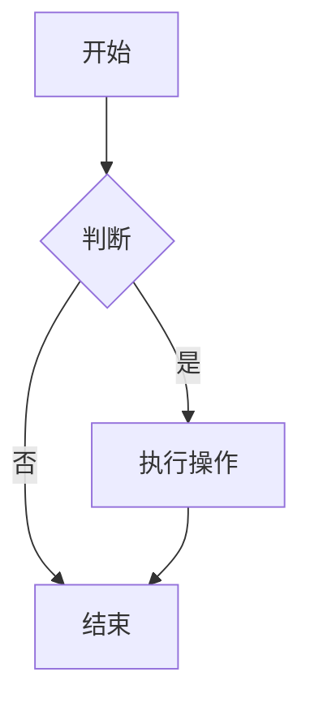
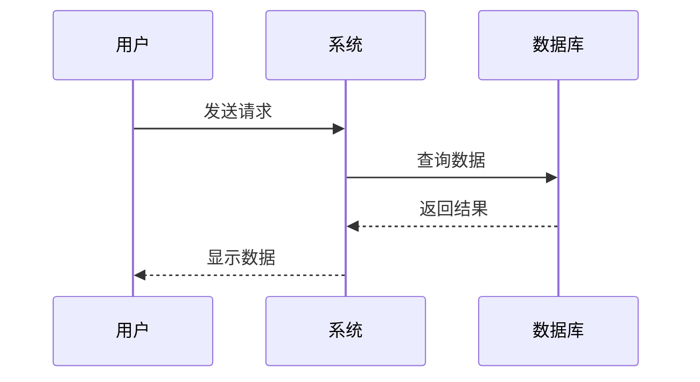
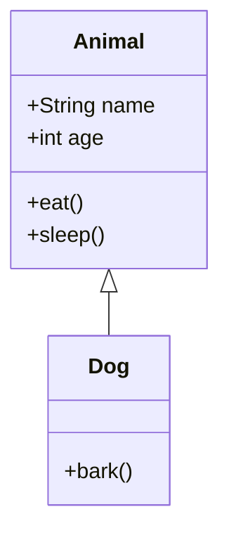
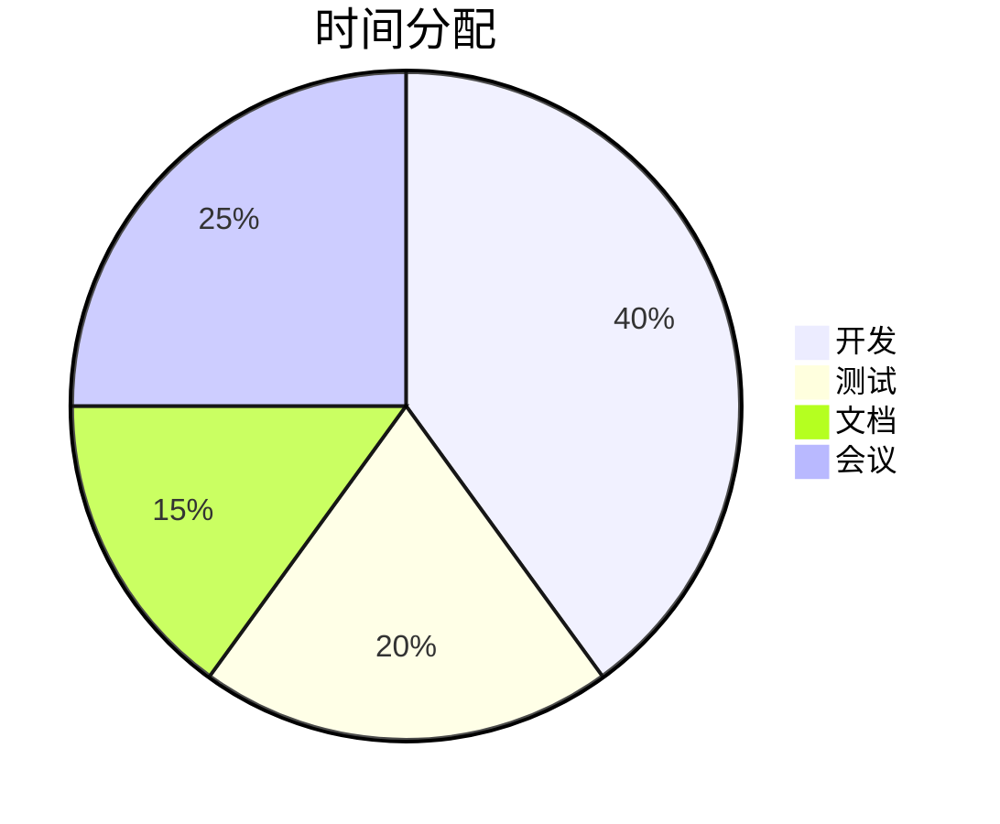
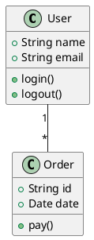
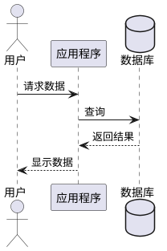
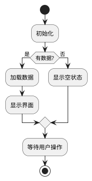

# Markdown 功能测试文档

## 基础文本格式

**粗体文本** 使用 `**text**` 或 `__text__`

_斜体文本_ 使用 `*text*` 或 `_text_`

**_粗斜体_** 使用 `**_text_**`

~~删除线~~ 使用 `~~text~~`

`行内代码` 使用 `` `code` ``

## 标题层级

# H1 标题
## H2 标题
### H3 标题
#### H4 标题
##### H5 标题
###### H6 标题

## 列表

### 无序列表
- 项目 1
- 项目 2
  - 子项目 2.1
  - 子项目 2.2
- 项目 3

### 有序列表
1. 第一项
2. 第二项
   1. 子项 2.1
   2. 子项 2.2
3. 第三项

## 链接和图片

[这是一个链接](https://example.com)


## 引用

> 这是一个引用块
> 
> 可以包含多行
> 
> > 可以嵌套引用

## 代码块

### JavaScript
```javascript
function hello() {
  console.log("Hello, World!");
  return true;
}
```

### Python
```python
def hello():
    print("Hello, World!")
    return True
```

### TypeScript
```typescript
interface User {
  name: string;
  age: number;
}

const user: User = { name: "Alice", age: 30 };
```

## 表格

| 列1 | 列2 | 列3 |
|-----|-----|-----|
| A1  | B1  | C1  |
| A2  | B2  | C2  |
| A3  | B3  | C3  |

对齐方式：

| 左对齐 | 居中对齐 | 右对齐 |
|:-------|:--------:|-------:|
| Left   | Center   | Right  |
| L      | C        | R      |

## 水平分割线

---

***

___

## 任务列表

- [x] 已完成的任务
- [ ] 未完成的任务
- [ ] 另一个任务

## Mermaid 图表

### 流程图


### 序列图


### 类图


### 饼图


## PlantUML 图表

### 类图


### 序列图


### 活动图


## GFM 特性（GitHub Flavored Markdown）

### 自动链接
https://github.com 会自动转换为链接

### 表情符号（如果支持）
:smile: :heart: :thumbsup:

### 脚注（如果支持）
这是一个脚注的示例[^1]

[^1]: 这是脚注的内容

## 特殊字符转义

\*不是斜体\*

\[不是链接\]

\# 不是标题

## HTML 内嵌（受限）

<div style="color: red;">红色文本</div>

<details>
<summary>点击展开</summary>
这是隐藏的内容
</details>

## 数学公式（如果支持）

行内公式：$E = mc^2$

块级公式：
$$
\int_{-\infty}^{\infty} e^{-x^2} dx = \sqrt{\pi}
$$

## 换行测试

这是第一行  
这是第二行（使用两个空格 + 换行）

这是第三行

这是第四行（使用空行）
