# Mermaid 图表语法指南

## 1. 流程图 (Flowchart)

### 基础语法
- `graph TD` - 从上到下
- `graph LR` - 从左到右
- `graph BT` - 从下到上  
- `graph RL` - 从右到左

### 示例

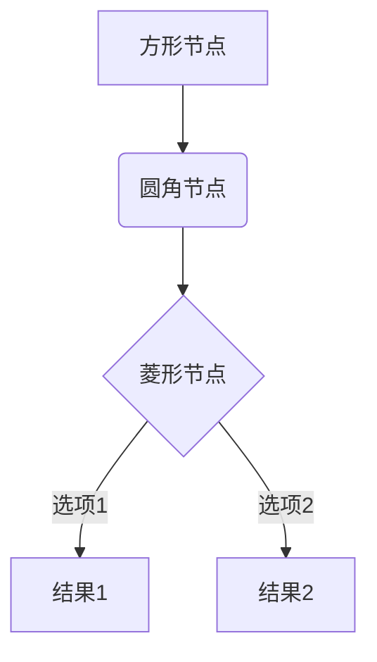

### 节点形状
- `[方形]` 矩形
- `(圆角)` 圆角矩形
- `{菱形}` 菱形/判断
- `((圆形))` 圆形
- `>不规则]` 旗帜形

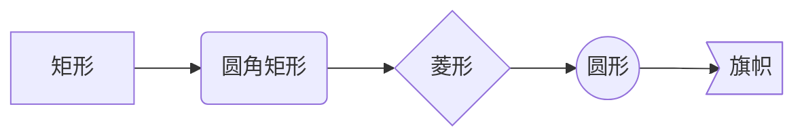

## 2. 序列图 (Sequence Diagram)

### 基础语法
- `participant` - 定义参与者
- `->>` - 实线箭头
- `-->>` - 虚线箭头
- `-x` - 结束线
- `autonumber` - 自动编号

### 示例

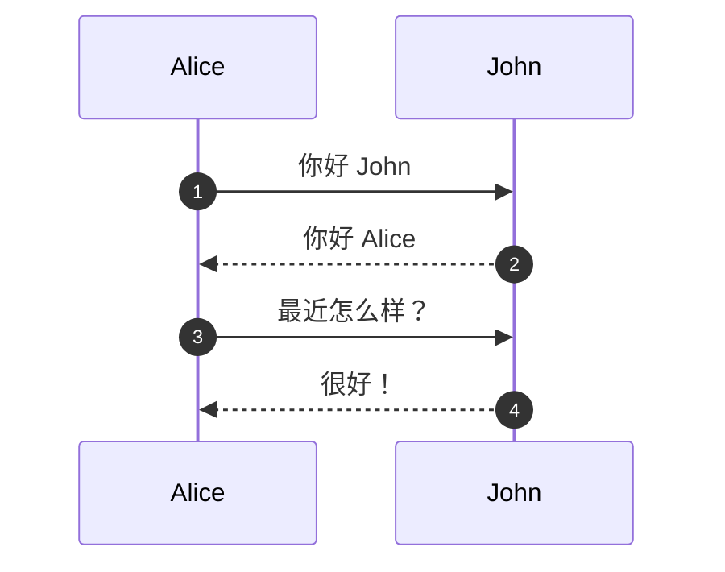

### 带循环和条件

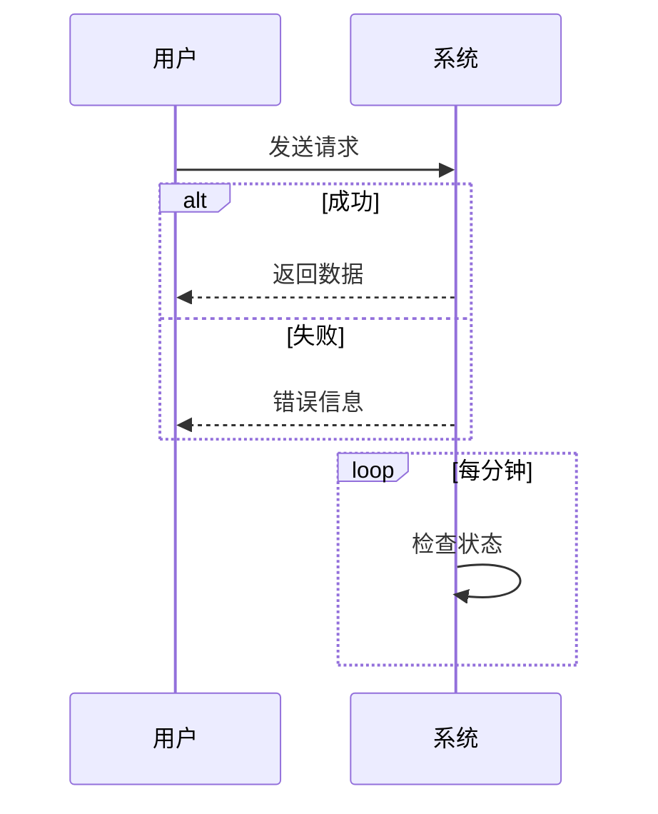

## 3. 类图 (Class Diagram)

### 基础语法
- `+` 公有
- `-` 私有
- `#` 受保护
- `<|--` 继承
- `*--` 组合
- `o--` 聚合

### 示例

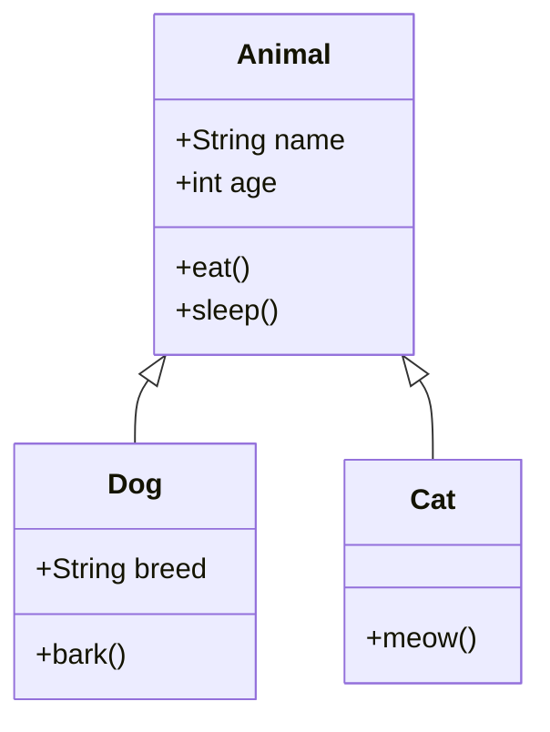

## 4. 状态图 (State Diagram)

### 示例

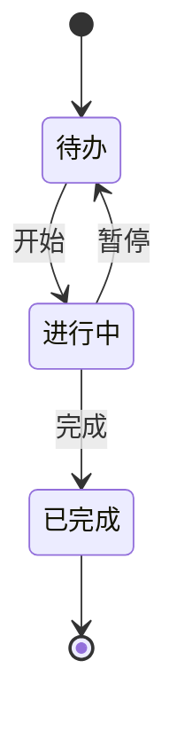

## 5. 甘特图 (Gantt Chart)

### 示例

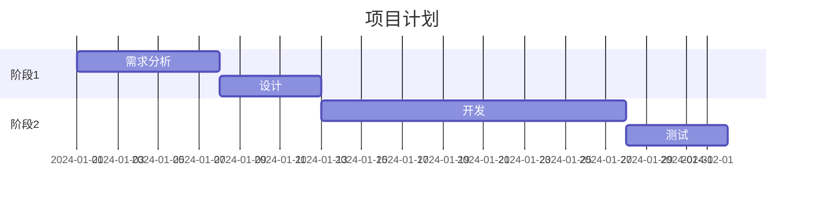

## 6. 饼图 (Pie Chart)

### 示例

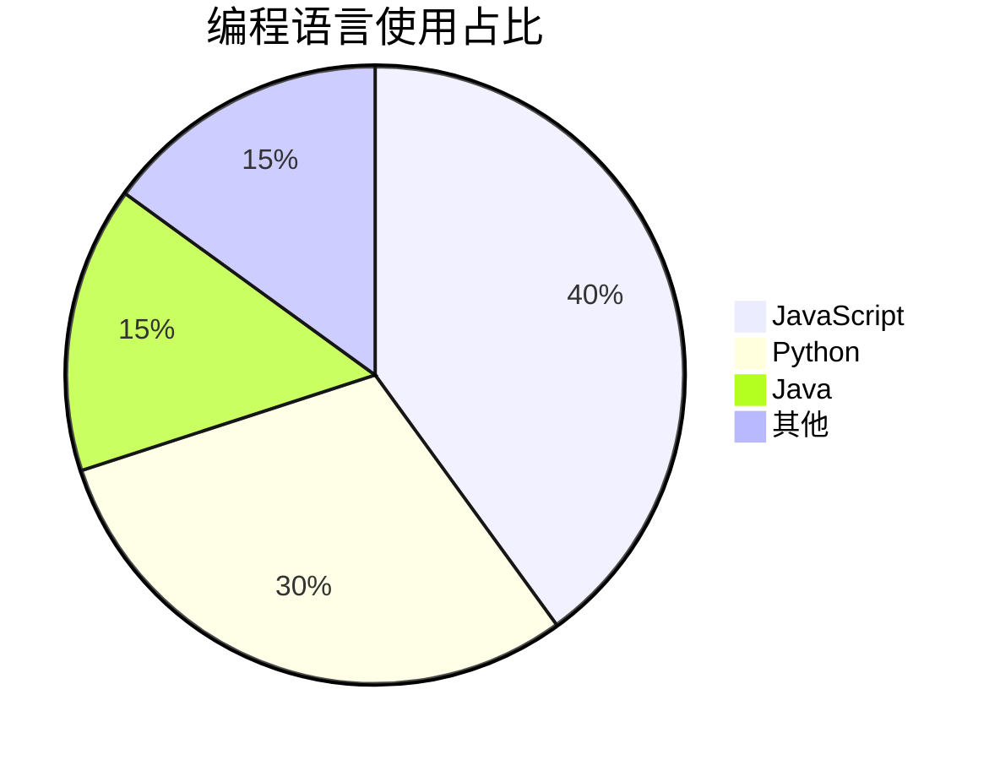

## 7. 实体关系图 (ER Diagram)

### 示例

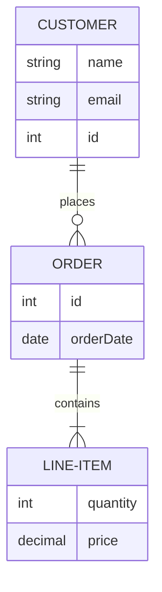

## 8. Git 图 (Git Graph)

### 示例

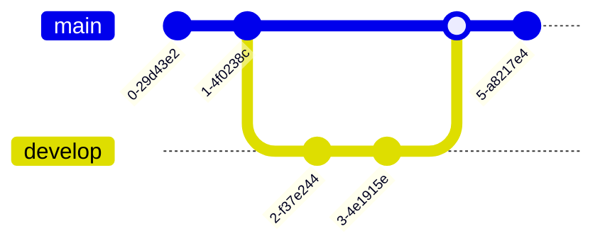

## 9. 用户旅程图 (User Journey)

### 示例

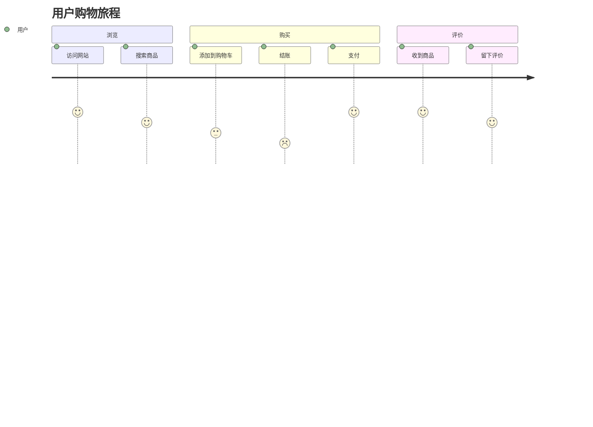

## 10. 时间轴 (Timeline)

### 示例

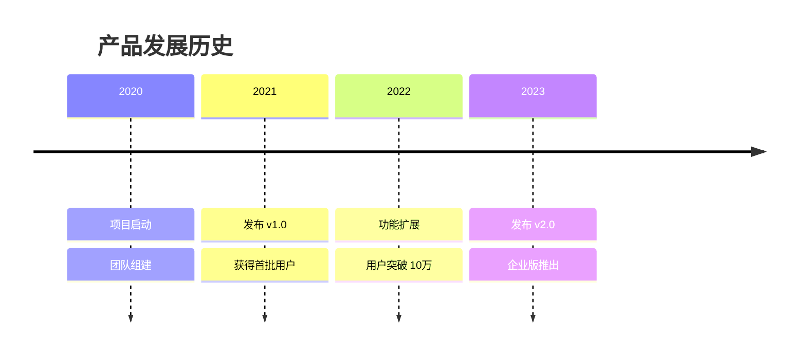

## 常见问题

### 1. 中文支持
Mermaid 完全支持中文，直接使用即可。

### 2. 主题
系统会自动根据深色/浅色模式切换主题。

### 3. 调试
如果图表不显示，检查：
- 语法是否正确
- 代码块标记是否为 \`\`\`mermaid
- 浏览器控制台是否有错误

### 4. 箭头类型
- `-->` 实线箭头
- `-.->` 虚线箭头  
- `==>` 粗箭头
- `->>` 序列图箭头
- `-->>` 序列图虚线箭头
