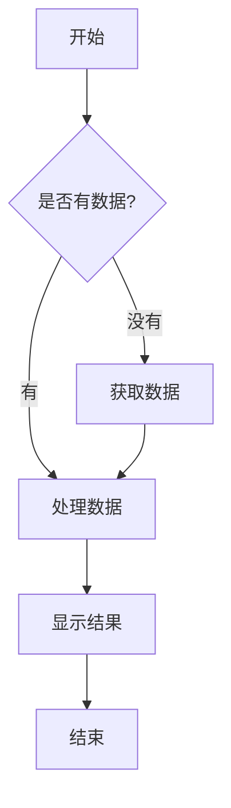
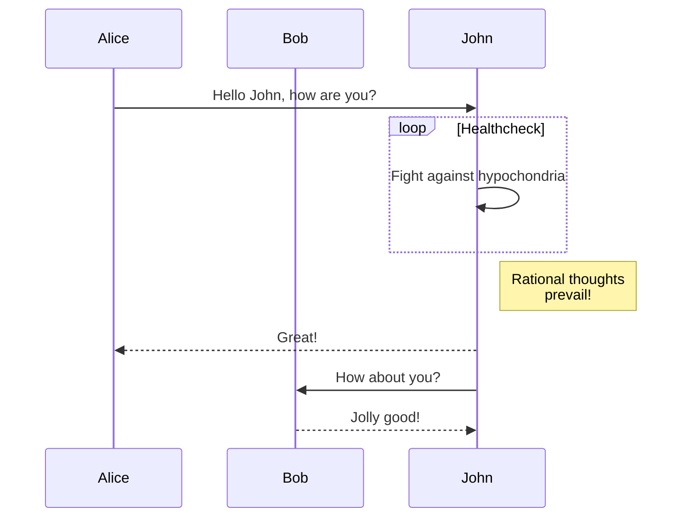
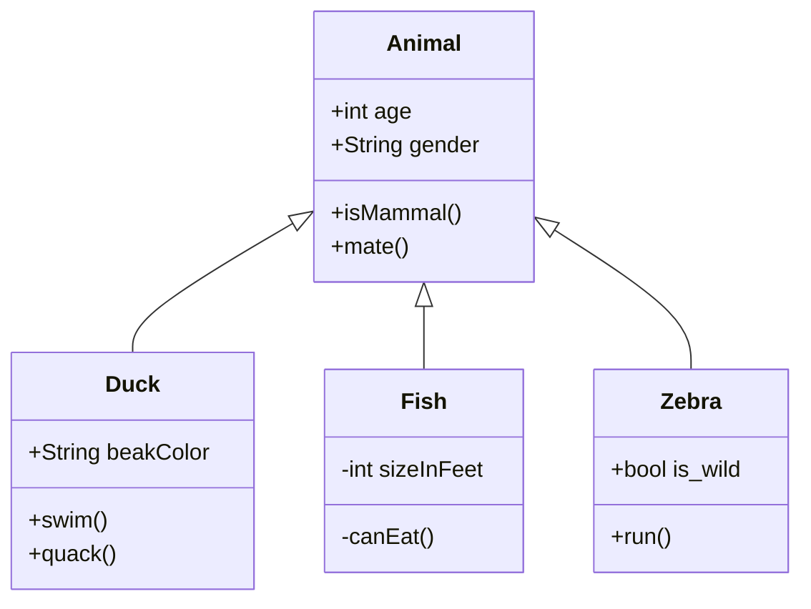
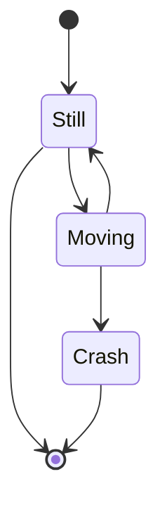
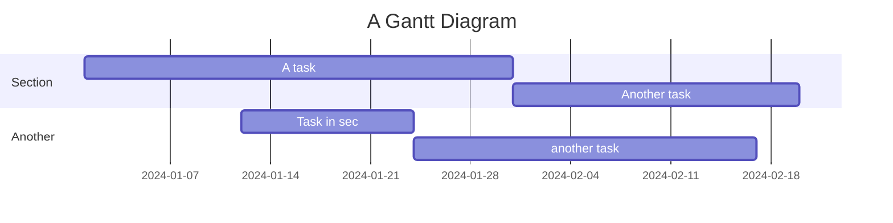
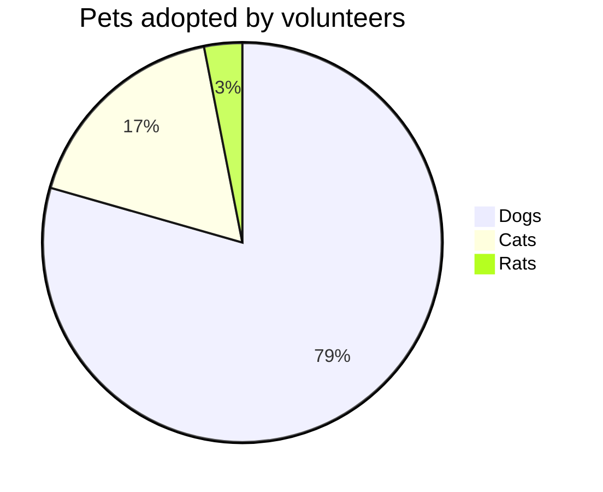
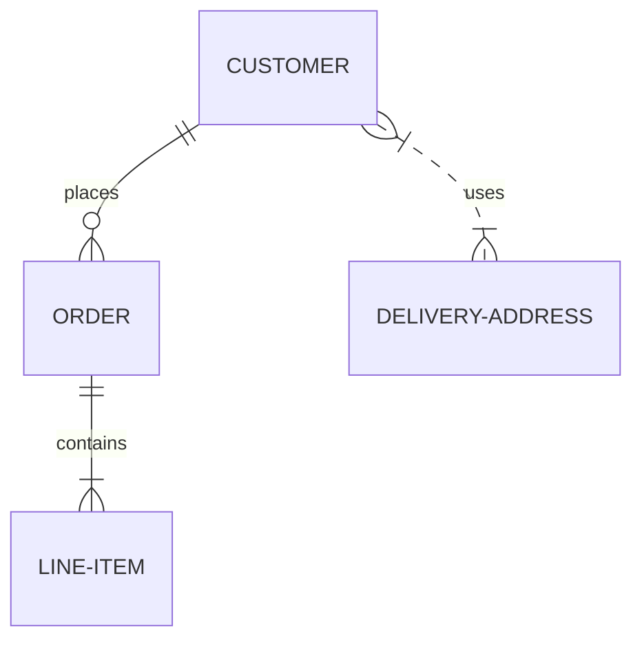
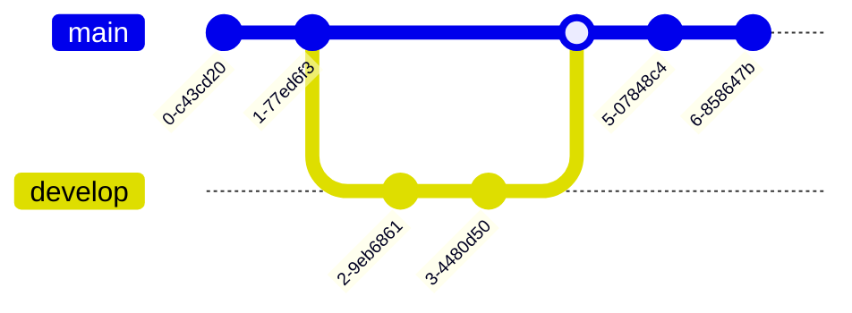

# Mermaid 图表测试

## 流程图测试

```mermaid
graph TD
    A[开始] --> B{是否有数据?}
    B -->|有| C[处理数据]
    B -->|没有| D[获取数据]
    C --> E[显示结果]
    D --> C
    E --> F[结束]
```

## 序列图测试

```mermaid
sequenceDiagram
    participant Alice
    participant Bob
    Alice->>John: Hello John, how are you?
    loop Healthcheck
        John->>John: Fight against hypochondria
    end
    Note right of John: Rational thoughts <br/>prevail!
    John-->>Alice: Great!
    John->>Bob: How about you?
    Bob-->>John: Jolly good!
```

## 类图测试

```mermaid
classDiagram
    Animal <|-- Duck
    Animal <|-- Fish
    Animal <|-- Zebra
    Animal : +int age
    Animal : +String gender
    Animal: +isMammal()
    Animal: +mate()
    class Duck{
        +String beakColor
        +swim()
        +quack()
    }
    class Fish{
        -int sizeInFeet
        -canEat()
    }
    class Zebra{
        +bool is_wild
        +run()
    }
```

## 状态图测试

```mermaid
stateDiagram-v2
    [*] --> Still
    Still --> [*]
    Still --> Moving
    Moving --> Still
    Moving --> Crash
    Crash --> [*]
```

## 甘特图测试

```mermaid
gantt
    title A Gantt Diagram
    dateFormat  YYYY-MM-DD
    section Section
    A task           :a1, 2024-01-01, 30d
    Another task     :after a1, 20d
    section Another
    Task in sec      :2024-01-12, 12d
    another task     :24d
```

## 饼图测试

```mermaid
pie title Pets adopted by volunteers
    "Dogs" : 386
    "Cats" : 85
    "Rats" : 15
```

## ER图测试

```mermaid
erDiagram
    CUSTOMER ||--o{ ORDER : places
    ORDER ||--|{ LINE-ITEM : contains
    CUSTOMER }|..|{ DELIVERY-ADDRESS : uses
```

## Git图测试

```mermaid
gitGraph
    commit
    commit
    branch develop
    checkout develop
    commit
    commit
    checkout main
    merge develop
    commit
    commit
```
