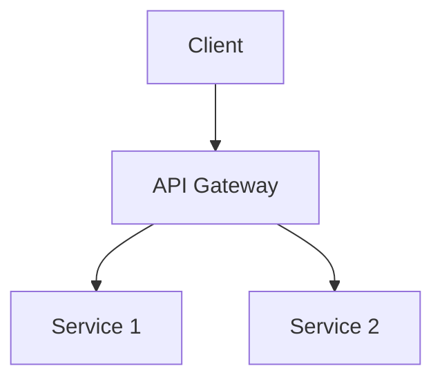
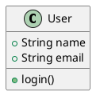

# Wiki Export Feature Documentation

## Overview

The Wiki Export feature allows you to export wiki pages as PDF or Word documents (.docx) with all content rendered, including:
- Markdown formatted text
- Images (embedded inline)
- **PlantUML diagrams** (rendered as images)
- **Mermaid diagrams** (rendered as images)
- Code blocks with syntax highlighting

## Features

### Supported Export Formats

1. **PDF Document** (`.pdf`)
   - Best for viewing and printing
   - Preserves layout and formatting
   - All diagrams and images embedded
   - Portable across all platforms

2. **Word Document** (`.docx`)
   - Best for editing and collaboration
   - Microsoft Word compatible
   - Editable text and formatting
   - Images and diagrams embedded

### Content Export

The export process includes:
- **Title**: Page title as main heading
- **Headings**: All markdown headings (H1-H6)
- **Text**: Paragraphs and formatted text
- **Images**: 
  - Inline images from markdown syntax
  - Fetched from URLs and embedded
- **PlantUML Diagrams**:
  - Fetched from PlantUML server as PNG
  - Embedded as images in document
- **Mermaid Diagrams**:
  - Rendered client-side to PNG
  - Embedded as images in document
- **Code Blocks**: Rendered with basic formatting

## Usage

### Exporting a Wiki Page

1. **Open a Wiki Page**: Navigate to the wiki page you want to export
2. **Click Export Button**: In the top toolbar, click the "📤 Export" button
3. **Choose Format**: Select either PDF or Word format from the modal
4. **Click Export**: The export process will begin
5. **Choose Save Location**: A file dialog will appear to choose where to save the file
6. **Wait for Completion**: The export may take a few seconds depending on the number of diagrams

### Export Modal Options

The export modal provides:
- **Page Preview**: Shows which page is being exported
- **Format Selection**: Radio buttons to choose PDF or Word
- **Status Display**: Shows export progress and any errors
- **Action Buttons**:
  - **Cancel**: Close modal without exporting
  - **Export**: Start the export process

## Technical Details

### Export Process

#### PDF Export
1. Parse markdown content and extract elements
2. For each code block:
   - **Mermaid**: Render diagram to PNG using Mermaid.js
   - **PlantUML**: Fetch diagram from PlantUML server as PNG
3. For each image: Fetch and convert to base64
4. Generate PDF using jsPDF:
   - Add title
   - Add headings with appropriate sizes
   - Add paragraphs with word wrapping
   - Embed images and diagrams
   - Handle page breaks automatically
5. Save PDF file using Tauri file dialog

#### Word Export
1. Parse markdown content and extract elements
2. Render diagrams same as PDF export
3. Generate Word document using docx library:
   - Create paragraphs for text
   - Create heading paragraphs with appropriate levels
   - Embed images with proper dimensions
   - Center diagrams for better presentation
4. Save .docx file using Tauri file dialog

### Dependencies

**Frontend (npm packages):**
- `jspdf` (^2.5.2): PDF generation
- `html-to-image` (^1.11.11): Capture diagrams as PNG
- `docx` (^9.0.4): Word document generation
- `html2canvas` (^1.4.1): HTML to canvas conversion (dependency)
- `@tauri-apps/plugin-fs` (^2): File system operations
- `@tauri-apps/plugin-dialog` (^2): Save file dialogs

**Backend (Rust):**
- `tauri-plugin-fs`: File system plugin for Tauri
- `tauri-plugin-dialog`: Dialog plugin for Tauri

### Limitations

1. **PlantUML Server Dependency**:
   - Requires internet connection
   - Uses public PlantUML server (www.plantuml.com)
   - Consider self-hosting for sensitive content

2. **Diagram Complexity**:
   - Very large or complex diagrams may take time to render
   - Image quality is optimized for file size

3. **Formatting**:
   - Some advanced markdown features may not translate perfectly
   - Tables are simplified in exports
   - Complex nested structures may lose formatting

4. **File Size**:
   - Documents with many images/diagrams will be larger
   - PDF files are generally smaller than Word documents

## Security Considerations

1. **PlantUML Privacy**:
   - Diagram content is sent to public PlantUML server
   - For sensitive diagrams, consider self-hosted PlantUML

2. **File System Access**:
   - Export uses Tauri fs plugin with scoped access
   - Can only save to user-selected locations
   - Follows Tauri security model

3. **Image Sources**:
   - External images are fetched from their URLs
   - Ensure image sources are trusted

## Troubleshooting

### Export Fails

**Symptoms**: Error message appears during export

**Solutions**:
1. Check internet connection (needed for PlantUML)
2. Verify diagram syntax is correct
3. Try exporting a simpler page first
4. Check browser console for detailed errors

### Diagrams Not Appearing in Export

**Symptoms**: Exported document missing diagrams

**Solutions**:
1. Ensure diagrams render correctly in preview
2. Check network tab for failed image requests
3. Verify PlantUML server is accessible
4. Try re-exporting after a moment

### Large File Size

**Symptoms**: Exported file is very large

**Solutions**:
1. Reduce number of high-resolution images
2. Simplify complex diagrams
3. Use PDF format instead of Word (smaller)
4. Consider splitting into multiple pages

### Slow Export

**Symptoms**: Export takes a long time

**Solutions**:
1. Be patient - many diagrams take time to render
2. Simplify or reduce number of diagrams
3. Check internet speed (for PlantUML)
4. Close other applications to free resources

## Best Practices

1. **Test Before Export**:
   - Preview all diagrams in wiki view first
   - Ensure all images load correctly
   - Check markdown formatting

2. **Optimize Content**:
   - Keep diagrams reasonably sized
   - Use compressed images when possible
   - Avoid excessive nesting

3. **Choose Right Format**:
   - Use PDF for final documents and sharing
   - Use Word for documents that need editing
   - Consider file size requirements

4. **Naming Convention**:
   - Use descriptive file names
   - Include date if creating versions
   - Follow organizational standards

5. **Privacy**:
   - Avoid sensitive info in PlantUML diagrams
   - Review exported content before sharing
   - Consider self-hosted PlantUML for sensitive work

## Examples

### Exporting Page with Mermaid

```markdown
# My System Architecture

## Overview
This is our system architecture.



## Details
More content here...
```

This will export as PDF/Word with the Mermaid flowchart rendered as an image.

### Exporting Page with PlantUML

```markdown
# Class Diagram


```

This will export with the PlantUML class diagram rendered as an image.

## Future Enhancements

Potential improvements:
- [ ] Batch export multiple pages
- [ ] Custom templates for exports
- [ ] Better table formatting in Word
- [ ] Compression options for large files
- [ ] Export to HTML format
- [ ] Self-hosted PlantUML option
- [ ] Export with table of contents
- [ ] Custom page size and margins
- [ ] Header and footer customization

## References

- [jsPDF Documentation](https://github.com/parallax/jsPDF)
- [docx Library](https://docx.js.org/)
- [Mermaid.js](https://mermaid.js.org/)
- [PlantUML](https://plantuml.com/)
- [Tauri Documentation](https://tauri.app/)

## Version History

### v1.0.0 (Current)
- Initial implementation
- PDF export support
- Word (DOCX) export support
- PlantUML diagram rendering
- Mermaid diagram rendering
- Image embedding
- File dialog integration
