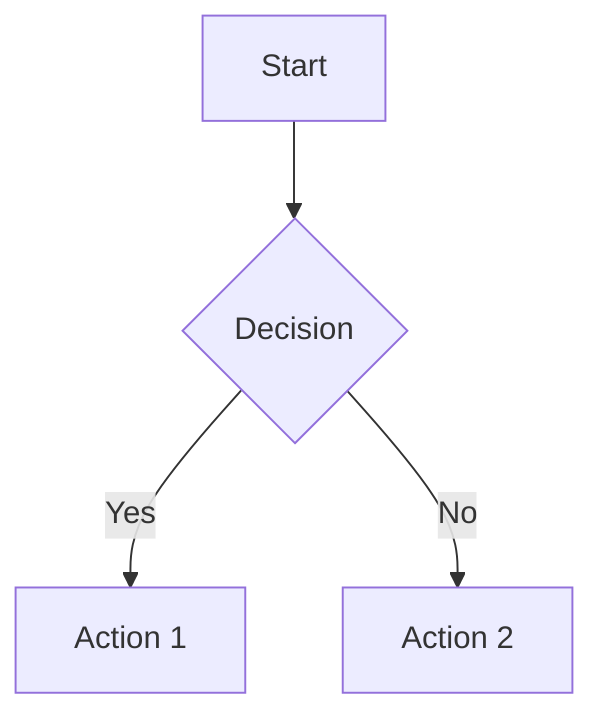
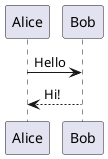
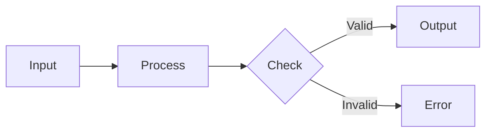
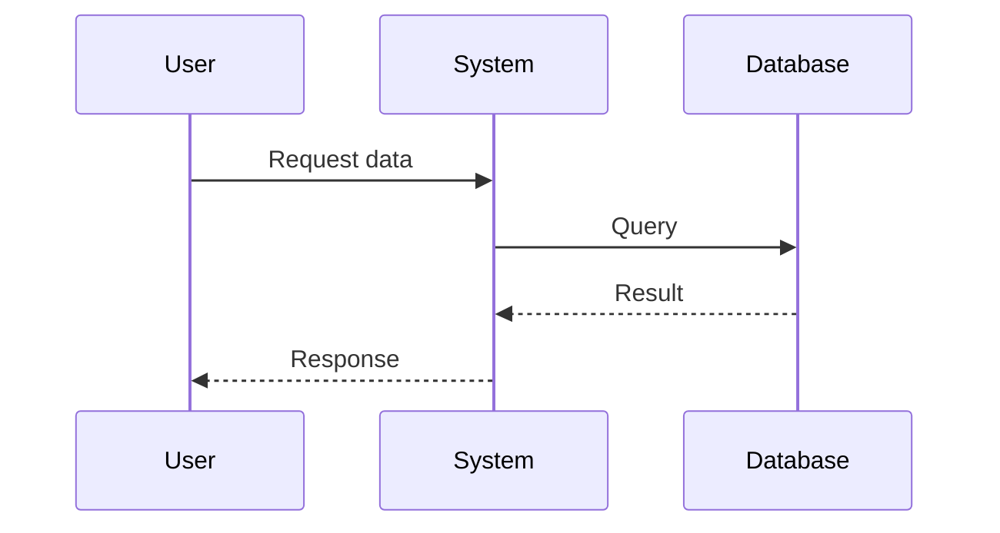
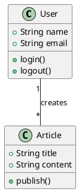
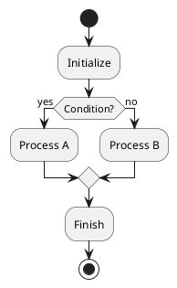

# 📚 Wiki Feature Documentation

## Overview

The Wiki feature is a powerful markdown-based knowledge management system built into the application. It supports rich text formatting, syntax highlighting, and now includes support for dynamic diagram rendering using PlantUML and Mermaid.

## Features

### Core Wiki Capabilities
- **Markdown Editing**: Full-featured markdown editor with live preview
- **Syntax Highlighting**: Code blocks with syntax highlighting powered by highlight.js
- **Version History**: Track changes with revision history
- **Tagging System**: Organize pages with tags
- **Search**: Full-text search across all wiki pages
- **Auto-save**: Automatic saving with visual feedback

### Diagram Support (New!)
The wiki now supports embedding two types of diagrams directly in markdown:

#### 1. Mermaid Diagrams
Mermaid is a JavaScript-based diagramming tool that renders diagrams from text definitions. It's rendered client-side for instant visualization.

**Supported Diagram Types:**
- Flowcharts
- Sequence diagrams
- Class diagrams
- State diagrams
- Entity Relationship diagrams
- Gantt charts
- Pie charts
- Git graphs
- User journey diagrams
- And more...

**Syntax:**
````markdown

````

#### 2. PlantUML Diagrams
PlantUML is a powerful tool for creating UML diagrams from simple text descriptions. Diagrams are rendered server-side using the public PlantUML server at www.plantuml.com.

**Supported Diagram Types:**
- Class diagrams
- Sequence diagrams
- Use case diagrams
- Activity diagrams
- Component diagrams
- State diagrams
- Object diagrams
- Deployment diagrams
- Timing diagrams
- And more...

**Syntax:**
````markdown

````

## Usage Examples

### Basic Mermaid Flowchart
````markdown

````

### Mermaid Sequence Diagram
````markdown

````

### PlantUML Class Diagram
````markdown

````

### PlantUML Activity Diagram
````markdown

````

## Technical Details

### Mermaid Configuration
- **Rendering**: Client-side using Mermaid.js v11.12.1
- **Theme**: Default theme with automatic dark/light mode support
- **Security**: Strict security level enabled
- **Performance**: Diagrams are rendered on-demand when content changes

### PlantUML Configuration
- **Rendering**: Server-side using www.plantuml.com
- **Format**: SVG for high-quality scalable diagrams
- **Encoding**: Uses plantuml-encoder for URL-safe diagram encoding
- **Privacy Note**: Diagram content is sent to the public PlantUML server. For sensitive content, consider self-hosting a PlantUML server.

### Security Measures
- HTML sanitization to prevent XSS attacks
- Strict CSP (Content Security Policy) for Mermaid
- No execution of inline event handlers
- Safe URL validation for external resources

## Styling

Diagrams are styled to match the application's theme:
- **Light Mode**: Clean, professional appearance with subtle backgrounds
- **Dark Mode**: High contrast with darker backgrounds for better visibility
- **Responsive**: Diagrams scale appropriately within the preview pane
- **Bordered Containers**: Clear visual separation from text content

## Troubleshooting

### Diagrams Not Rendering

**Mermaid Issues:**
- Check browser console for errors
- Verify diagram syntax is correct
- Ensure no conflicting CSS is affecting the preview
- Try refreshing the page

**PlantUML Issues:**
- Check internet connection (requires access to www.plantuml.com)
- Verify PlantUML syntax with @startuml and @enduml tags
- Check browser console for image loading errors
- Try a simpler diagram to test connectivity

### Common Syntax Errors

**Mermaid:**
- Missing graph type declaration (e.g., `graph TD`, `sequenceDiagram`)
- Invalid node connections (use `-->`, `->`, `---`, etc.)
- Incorrect indentation in complex diagrams

**PlantUML:**
- Missing `@startuml` or `@enduml` tags
- Invalid relationship syntax
- Typos in PlantUML keywords

## Examples File

See `DIAGRAM_EXAMPLES.md` for a comprehensive collection of example diagrams you can use as templates.

## Best Practices

1. **Keep diagrams simple**: Complex diagrams can be hard to maintain
2. **Use meaningful labels**: Make diagrams self-documenting
3. **Add comments**: Use comments in your diagram code for complex logic
4. **Test incrementally**: Build diagrams step by step to catch errors early
5. **Use consistent styling**: Stick to one diagram type for similar concepts
6. **Consider privacy**: Use self-hosted PlantUML for sensitive diagrams

## References

- [Mermaid Documentation](https://mermaid.js.org/)
- [PlantUML Documentation](https://plantuml.com/)
- [Markdown Guide](https://www.markdownguide.org/)

## Future Enhancements

Potential improvements for future versions:
- Self-hosted PlantUML server option
- Diagram export functionality (PNG, SVG)
- Diagram editor with visual interface
- Additional diagram libraries (GraphViz, D3.js)
- Collaborative editing with live diagram updates
- Diagram templates library
- Custom theme support for diagrams
